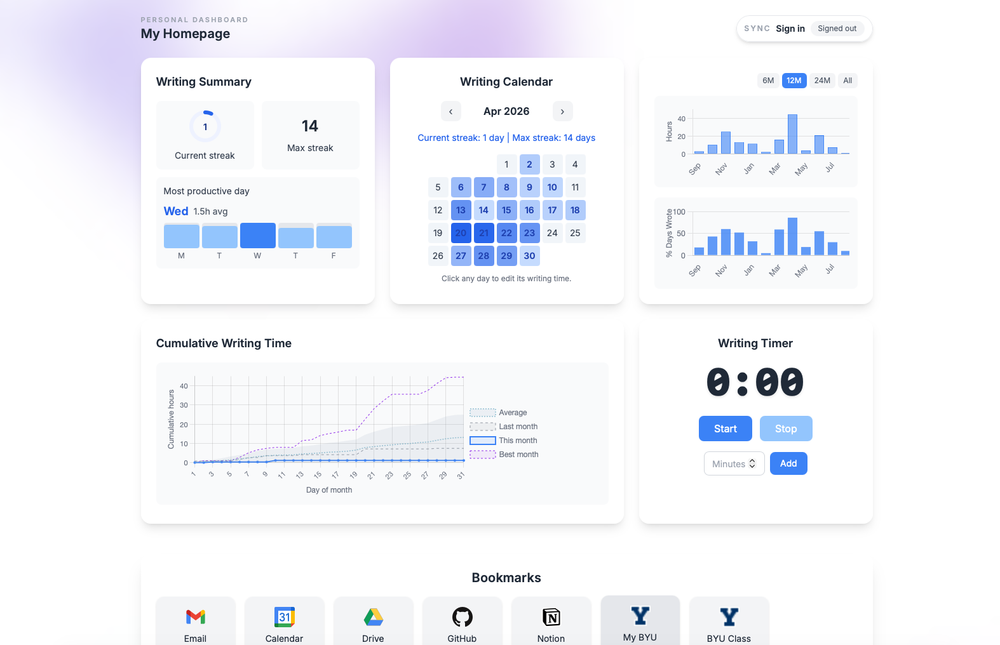

# Personal Writing Tracker Homepage

A configurable, no-build dashboard for bookmarks, writing progress, habits,
weather, quotes, and a personal countdown/count-up timer.

Try the shared version at
[bradymoon.com/writing-tracker-homepage](https://bradymoon.com/writing-tracker-homepage/).



## Choose how you want to use it

There are three independent decisions. You do not need to choose a special
package or follow every setup path.

### 1. Where should the page run?

- **Use the shared website:** open the link above. Nothing needs to be
  installed, and browser customization is available immediately.
- **Run your own local copy:** download or clone the repository and open
  `index.html`. This works from a normal `file://` address with no build step.
- **Host your own copy:** fork the repository and enable its included GitHub
  Pages workflow. Your fork becomes a separately managed website.

### 2. How should it be customized?

- **In the browser:** select **Customize**. This is the easiest way to change
  the title, timer, weather, visible sections, ordering, quotes, and bookmarks.
  These choices apply only to you; they do not alter the public repository.
- **In the files:** edit `js/app-config.js`. This is best for a local clone or
  fork when you want durable defaults that are committed and shared with every
  visitor to your copy.

A browser customization overrides `app-config.js` in that browser. Select
**Reset to site defaults** in the panel to see later file changes again.

### 3. Where should personal data be stored?

- **This browser:** the default. No account is required. Tracker data and
  browser customization stay in this browser profile.
- **Approved shared Supabase:** request an account from the owner, then sign in
  on the shared page. Tracker data and browser customization sync to that
  account.
- **Your own Supabase:** create a project you control, apply the included SQL,
  and point your local copy or fork to it. Follow
  [SUPABASE_SETUP.md](SUPABASE_SETUP.md).

Hosting and storage are separate choices. For example, a local `file://` copy
can still use Supabase, and a GitHub Pages copy can remain entirely local in
each visitor's browser.

## Common starting points

### Use the shared site without an account

1. Open the [shared homepage](https://bradymoon.com/writing-tracker-homepage/).
2. Select **Customize**, make your changes, and select **Save and reload**.
3. Keep using local browser storage. Export a dashboard backup regularly.

### Pull it locally

1. Download the repository as a ZIP, or clone it:

   ```sh
   git clone https://github.com/bradygm/writing-tracker-homepage.git
   cd writing-tracker-homepage
   ```

2. Open `index.html` in a browser.
3. Use **Customize** for browser-specific settings, or edit
   `js/app-config.js` for durable defaults.
4. Keep data locally, sign in with an approved shared account, or configure a
   Supabase project you control.

You can set the local file as your browser homepage. Safari permits a local
file as the homepage for new windows, but its new-tab behavior is more limited.

### Fork and host it yourself

1. Fork the repository on GitHub.
2. Review `js/app-config.js`. Disable or replace the included Supabase project
   before presenting the fork as your own service.
3. Open **Settings → Pages** in the fork.
4. Under **Build and deployment → Source**, choose **GitHub Actions**.
5. Push to `main` and watch **Deploy GitHub Pages** in the Actions tab.

The project uses relative paths and needs no build command. Each later push to
`main` redeploys the site automatically.

## Browser customization options

The **Customize** panel currently supports:

- Homepage title and favicon
- Countdown/count-up timer label and date
- Dashboard-backup reminder interval
- Main-section visibility and order
- Dashboard-widget visibility and order
- Weather location, coordinates, and units
- Quotes
- Bookmarks, their order, icons, stable IDs, and new-tab behavior

Deployment-owner settings are intentionally excluded. Supabase project values
and access-request contact details remain in `js/app-config.js` so a visitor
cannot accidentally replace the site's connection configuration.

See [CUSTOMIZATION.md](CUSTOMIZATION.md) for exact behavior and the complete
file-based configuration reference.

## Local data and backups

Local storage is convenient but not a durable backup. Clearing site data,
changing browsers or profiles, switching between the hosted and `file://`
versions, or some cleanup tools can remove it.

The **Export** control downloads one versioned JSON backup containing writing
history, habit data, bookmark counters, and browser customization. **Import**
restores those areas after asking for confirmation. Older writing-only exports
remain supported and replace only writing history.

Backups intentionally exclude passwords, Supabase connection/owner settings,
the current Auth session, and a writing timer that is actively running. Keep a
recent backup somewhere safe; it can contain private tracker data, quotes, and
bookmark URLs.

Hosted origins normally have separate browser storage. `file://` storage is
browser-specific, however, and Safari can reuse the same storage keys across
different local HTML files. If you keep multiple homepage copies and need them
isolated, host them at different HTTPS origins or serve them from distinct local
HTTP origins. Customizing the shared website does not automatically customize a
local clone unless you sign in and use the same Supabase account.

## Optional shared cloud sync

The shared deployment supports manually approved email/password accounts. Open
the backup/sync pill for request instructions.

An access request does not create an account. The owner reviews it and creates
a confirmed Supabase Auth user manually. 

When signed in, writing history, habit state, bookmark counters, and browser
customization are stored in the account's protected `user_state` row. Signing
out clears that account's synced state from the current browser and returns the
page to its public defaults.

## Privacy and security

- Everything committed to `js/app-config.js` is public in a public repository
  or deployment. Do not add passwords, tokens, private document links, signed
  URLs, or service-role keys.
- Browser customizations are private to the browser unless cloud sync is active
  or the user deliberately exports a backup. Synced bookmarks and quotes are
  stored in that user's Supabase row.
- A Supabase project URL and publishable key are safe to expose in frontend
  code. Database protection comes from authentication, grants, and row-level
  security. Secret and service-role keys must never be added to the page.
- The page loads fonts, JavaScript libraries, bookmark icons, and weather data
  from third parties. Those services receive ordinary request information such
  as an IP address.
- The shared site redirects HTTP to HTTPS through Cloudflare. A self-hosted fork
  should also enforce HTTPS before enabling password sign-in.

Before publishing a fork, search the whole repository for private names, email
addresses, URLs, coordinates, credentials, and identifiers.

## Project structure

```text
.
├── index.html                 # Page structure and customization dialog
├── css/styles.css             # Page and responsive styling
├── js/
│   ├── app-config.js          # Durable site defaults and owner settings
│   ├── customization.js       # Browser customization and preference sync
│   └── ...                    # Widgets, storage, and page behavior
├── supabase/user_state.sql    # Optional cloud-sync schema and RLS
├── CUSTOMIZATION.md           # Browser and file configuration reference
├── SUPABASE_SETUP.md          # Bring-your-own-Supabase walkthrough
└── IMPLEMENTATION_PLAN.md     # Scope, decisions, and remaining validation
```

## Feature requests and issues

Pull requests, issues, feature requests, and ideas are welcome.
